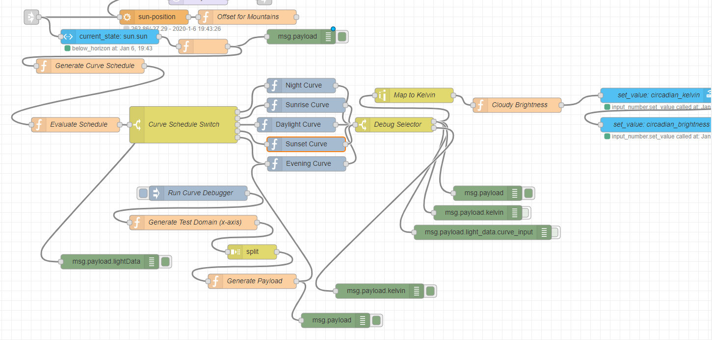
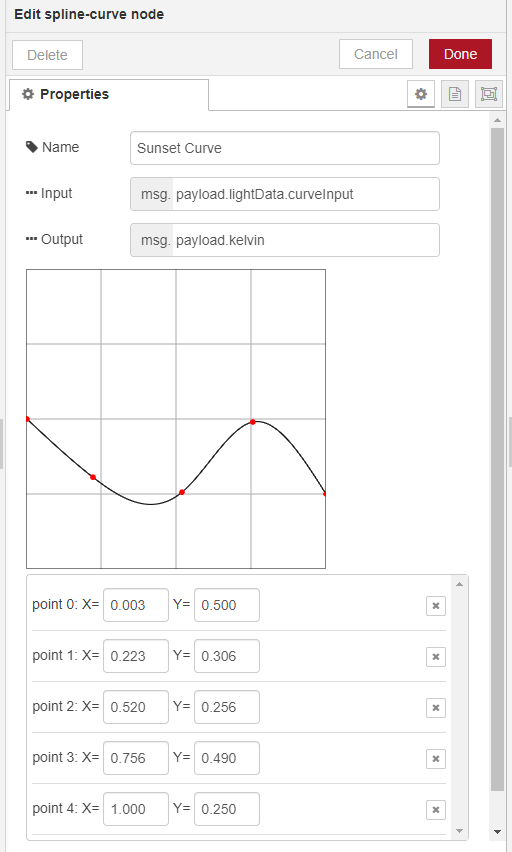

# Spline Curve
**node-red-contrib-spline-curve**

This node takes float input in the range 0.0 to 1.0 (inclusive) and outputs a float in the range 0.0 to 1.0 (inclusive) as configured from the node's graphical interface.

This node is designed to work and be configured the same way as Gimp's Color Curve, or Unity Engine's Curve module.  The interpolation between points is using Cubic Spline Interpolation.

In essence, it allows you to design a curve using a few points through a graphical interface.  This is particularly useful when designing functions for their aesthetic properties such as color temperature of a light at different times. It's very useful in expressing the qualitative properties of a value over time, as used in animation.

